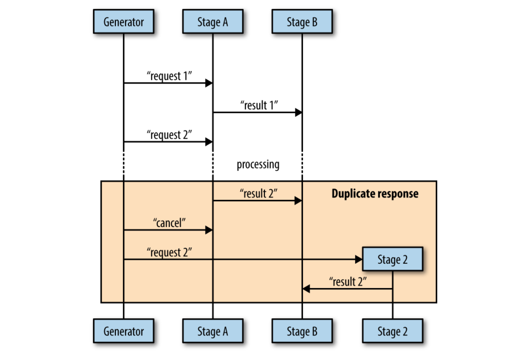

# Concurrency at Scale

## Error Propagation

- **Motivation**: it's both easy for something to go wrong in your system, and difficult to understand why it happened

### Errors

- Errors indicate that your system has entered a state in which it cannot fulfill an operation that a user either explicitly or implicitly requested. The critical information it relays (should be added manually) include

  - What happened
  - When and where it occurred

    > Errors should contain
    >
    > - **always** a complete **stack trace**
    >   - starting with how the call was initiated
    >   - ending with where the error was instantiated
    >   - not contained in the error message (more on this in a bit)
    > - information regarding its running context
    > - the time on the machine the error was instantiated on, in UTC

  - A about-one-line friendly user-facing message
  - How the user can get more information
    > Errors that are presented to users should provide an **ID** that can be cross-referenced to a corresponding log that displays the full information of the error
    >
    > - time the error occurred (not the time the error was logged)
    > - the stack trace

- 2 Categories
  - Bugs: errors that you have not customized to your system, or "raw" errors -- your known edge cases
  - Known edge cases (e.g., broken network connections, failed disk writes, etc.)
- At the boundaries of each component, all incoming errors must be wrapped in a well-formed error for the component our code is within
  > - It is only necessary to wrap errors in this fashion at your own module boundaries—public functions/methods—or when your code can add valuable context
  > - Well-formed incoming errors helps to control how errors escape our module.
- All errors should be logged with as much information as is available
- A well-formed error received by user-facing code can be simply logged and displayed to user
- When malformed errors, or bugs, are propagated up to the user, we should **also log the error, but then display a friendly message to the user stating something unexpected has happened**
  > - If we support automatic error reporting in our system, the error should be reported back as a bug
  > - Otherwise, we might suggest the user file a bug report

## Timeouts and Cancellation

### Why Timeouts

- System saturation (i.e., its ability to process requests is at capacity)
  - general guidelines for when to time out
    - If the request is unlikely to be repeated when it is timed out
    - If you don't have the resources to store the requests
    - If the need for the request, or the data it's sending, will go stale
- Stale data
  - data has a window within which it must be processed before more relevant data is available, or the need to process the data has expired.
  - managed by `context.Context` created with
    - `context.WithDeadline`, or `context.WithTimeout` for the timing window known beforehand
    - `context.WithCancel`, otherwise
- Attempting to prevent deadlocks
  - The timeout period's purpose is only to prevent deadlock, and so it only needs to be short enough that a deadlocked system will unblock in a reasonable amount of time for your use case
  - It is preferable to chance a livelock and fix that as time permits, than for a deadlock to occur and have a system recoverable only by restart

### Why Cancellation

- Timeouts
- User intervention
- Parent cancellation
- Replicated requests
  - Scenario: data are sent to multiple concurrent processes in an attempt to get a faster response from one of them

### Job after Cacellation

#### The preemptability of a concurrent process

##### non-preemptable job 1

```go
var value interface{}
select {
case <-done:
  return
case value = <-valueStream:
}

// next line is non-preemptable
// which will block the cancellation for a long time during execution
result := reallyLongCalculation(value)

select {
case <-done:
  return
case resultStream <- result:
}
```

##### non-preemptable job 2

```go
reallyLongCalculation := func(
  done <-chan interface{},
  value interface{},
) interface{} {
  intermediateResult := longCalculation(value)
  select {
  case <-done:
    return nil
  default:
  }
}

return longCaluclation(intermediateResult)
```

> `longCalculation()` may still block cancellation during execution

##### ok job as `preemptability/main.go`

##### 2 steps to achieve preemptability

- define the period within which our concurrent process is preemptable
- ensure that any functionality that takes more time than this period is itself preemptable

#### Problems

##### quit from shared state

**solution**: If possible, build up intermediate results in-memory and then modify state as quickly as possible

- wrong way

```go
result := add(1, 2, 3)
writeTallyToState(result)
result = add(result, 4, 5, 6)
writeTallyToState(result)
result = add(result, 7, 8, 9)
writeTallyToState(result)
```

- good way

```go
result := add(1, 2, 3, 4, 5, 6, 7, 8, 9)
writeTallyToState(result)
```

##### duplicated messages

- **use case**



- **solutions**
  - Make it vanishingly unlikely that a parent goroutine will send a cancellation signal after a child goroutine has already reported a result
  - Accept either the first or last result reported
  - Poll the parent goroutine for permission
    > heartbeats are more generally useful than this approach

## Heartbeats

- **Motivation**: help concurrent processes signal life to outside parties
- 2 types 
  - periodic: occur on a time interval, useful for concurrent code that might be waiting for something else to happen for it to process a unit of work
  - one-time: occur at the beginning of a unit of work, useful for testing
- A heartbeat is a way to signal to its listeners that everything is well, and that the silence is expected
- Periodic heartbeats helps to debug the the unexpected behaviors of goroutines (demo as [`monitor.go`](./heartbeats/monitor.go))
- For any long-running goroutines, or goroutines that need to be tested, this pattern is highly recommended

## Replicated Requests  

- **Motivation**: For some applications, receiving a response as quickly as possible is the top priority
- In-memory replication might not be that costly, but if replicating the handlers requires replicating processes, servers, or even data centers, this can become quite costly. The trade-off should be considered seriously
- A demo go as [replicates a simulated request over 10 handlers](./replication/main.go)
- The only **caveat** to this approach is that all of your handlers need to have equal opportunity to service the request 
- A different symptom of the same problem is **uniformity**. You should only replicate out requests like this to handlers that have different runtime conditions: different processes, machines, paths to a data store, or access to different data stores altogether

## Rate Limiting 

- **Motivation**: constrains the number of times some kind of resource is accessed to some finite number per unit of time, to as to prevent entire classes of attack vectors against your system
- **Problems**
  - In distributed systems, a legitimate user could degrade the performance of the system for other users if they're performing operations at a high enough volume, or if the code they’re exercising is buggy.
    > A user's mental model is usually that their access to the system is sandboxed and can neither affect nor be affected by other users' activities
- Rate limits allow you to reason about the performance and stability of your system by preventing it from falling outside the boundaries you've already investigated.
- Rate limits helps to protect paying customers from accessing the paid system in a runaway manner, which would means either
  - the service owner eat the cost and forgive the unintended access, or 
  - the user is forced to pay the bill, which might sour the relationship permanently

### The Token Bucket Algorithm  
- Most rate limiting is done by utilizing an algorithm called the **token bucket**: an access token for the resource is granted to utilize a resource. Without the token, your request is denied
- 2 parameters  
    - `d`: depth of the bucket, i.e., how many tokens are available for immediate use, a.k.a., **burstiness**
    - `r`: replenishing rate


#### Demo without Rate Limiting  
An API has two endpoints: one for reading a file, and one for resolving a domain name to an IP address

Demo as command `go generate -tags without`

### The `rate` Package

#### API
- `Limit` and `NewLimiter`

```go
// Limit defines the maximum frequency of some events. Limit is
// represented as number of events per second. A zero Limit allows no
// events.
type Limit float64

// NewLimiter returns a new Limiter that allows events up to rate r
// and permits bursts of at most b tokens.
func NewLimiter(r Limit, b int) *Limiter
```

- `Every` 
```go
// Every converts a minimum time interval between events to a Limit.
// Return rate.Inf for zero interval
func Every(interval time.Duration) Limit
```

- `Wait`/`WaitN` block requests until were given `1`/`N` access token(s)

```go
// Wait is shorthand for WaitN(ctx, 1).
func (lim *Limiter) Wait(ctx context.Context)

// WaitN blocks until lim permits n events to happen.
// It returns an error if n exceeds the Limiter's burst size, the Context is
// canceled, or the expected wait time exceeds the Context's Deadline.
func (lim *Limiter) WaitN(ctx context.Context, n int) (err error)
```

#### Granularity  
- Establish multiple tiers of limits
    - **fine-grained** controls to limit requests per second
    - **coarse-grained** controls to limit requests per minute, hour, or day
- Demo as command `go generate`

> The limit is constrained by a sliding window of time as proved by the request #1

#### More 
the `rate.Limiter` type has a few other tricks up its sleeve for optimizations and different use cases

## Healing Unhealthy Goroutines
- **Motivation**: a goroutine to become stuck in a bad state from which it cannot recover without external help
- **Healing**: the processing of restarting the unhealthy goroutines

- **steward**
    -  the logic that monitors a goroutine's health
    - responsible for restarting a ward's goroutine by invoking a **ward** maker function should it become unhealthy
start the goroutine
- **ward**: the goroutine monitored by **steward**

- 2 demos go as [usage.go](./healing-unhealthy-goroutines/usage.go) and [more.go](./healing-unhealthy-goroutines/more.go)